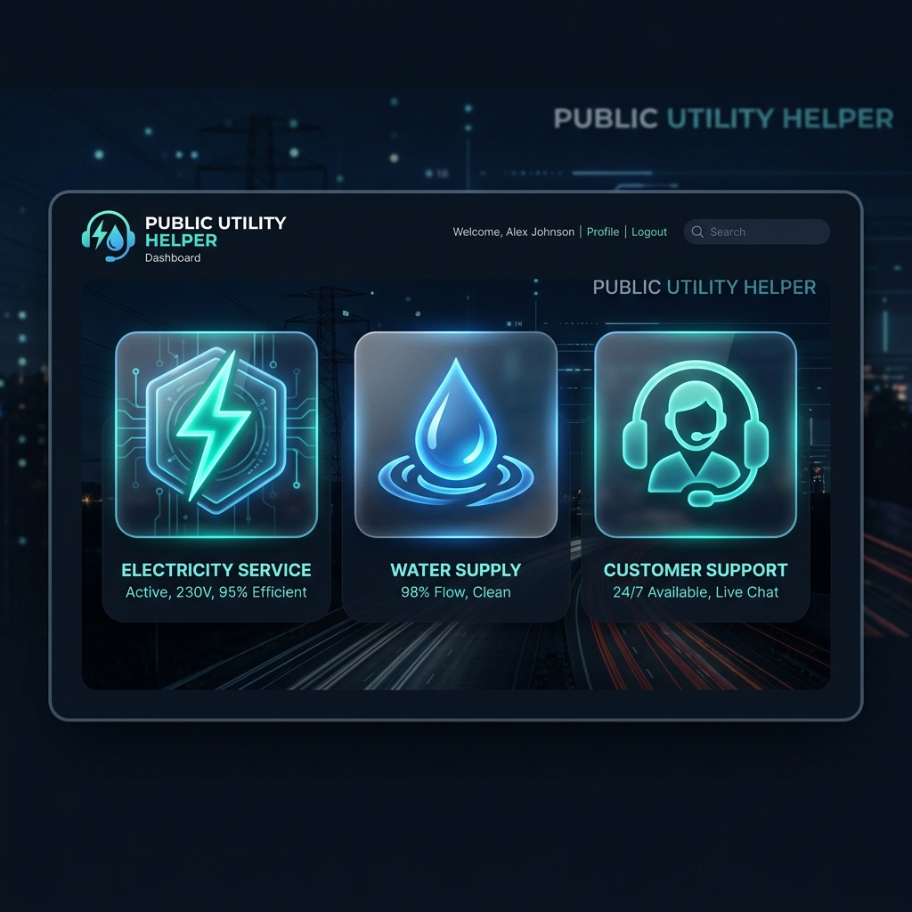

<div align="center">



# 🌐 Public Utility Helper

**A Modern, Responsive Portal for Streamlining Public Service Management**

[](https://reactjs.org/)
[](https://vitejs.dev/)
[](https://lucide.dev/)
[](https://developer.mozilla.org/en-US/docs/Web/CSS)

[Features](#-key-features) • [Installation](#-getting-started) • [Tech Stack](#%EF%B8%8F-tech-stack) • [Screenshots](#-preview)

</div>

---

## 📖 Overview

The **Public Utility Helper** is a specialized web application designed to bridge the gap between utility providers and citizens. Whether it's reporting a power outage, filing a complaint about water supply, or checking real-time queue statuses at utility offices, this portal provides a seamless, high-performance interface for all public utility needs.

## 🚀 Key Features

| Feature | Description | Icon |
| :--- | :--- | :---: |
| **Complaint Management** | Comprehensive system to file, track, and resolve utility-related grievances. | 📝 |
| **Outage Tracking** | Real-time monitoring of electricity and water outages with scheduled maintenance updates. | ⚡ |
| **Queue Status** | Live updates on service queue lengths to help citizens plan their visits efficiently. | ⏳ |
| **Responsive Design** | Fully optimized for mobile, tablet, and desktop viewing. | 📱 |
| **Interactive UI** | Smooth animations and intuitive navigation for enhanced user experience. | ✨ |

## 🛠️ Tech Stack

- **Frontend:** React.js (Vite)
- **Routing:** React Router DOM
- **Icons:** Lucide React
- **Styling:** Custom Vanilla CSS (Modular & Responsive)
- **Development Tooling:** ESLint, Vite HMR

## 💻 Getting Started

### Prerequisites

- [Node.js](https://nodejs.org/) (v16 or higher)
- [npm](https://www.npmjs.com/) or [yarn](https://yarnpkg.com/)

### Installation

1. **Clone the repository:**
   ```bash
   git clone https://github.com/yourusername/public-utility-helper.git
   cd public-utility-helper
   ```

2. **Install dependencies:**
   ```bash
   npm install
   ```

3. **Run the development server:**
   ```bash
   npm run dev
   ```

4. **Build for production:**
   ```bash
   npm run build
   ```

## 📂 Project Structure

```text
public-utility/
├── src/
│   ├── components/       # Reusable UI components (Navbar, etc.)
│   ├── pages/            # Page-level components (Home, Complaint, Outage, Queue)
│   ├── assets/           # Images, logos, and static assets
│   ├── data.js           # Mock data for demonstration
│   ├── App.jsx           # Main application routing
│   └── main.jsx          # Entry point
├── public/               # Static public assets
└── vite.config.js        # Vite configuration
```

## 📸 Preview

<div align="center">
  
  <br>
  <em>Dashboard Interface - Clean and Intuitive</em>
</div>

---

<div align="center">

Built with ❤️ for a better citizen experience.

[⭐ Star this repository if you find it useful!](https://github.com/yourusername/public-utility-helper)

</div>
